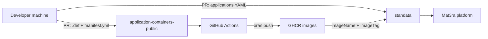

# Bring Your Application to Mat3ra

A video tutorial transcript for advanced users and developers who want to bring
their own application to the Mat3ra platform as a first-class, selectable
option in the UI and via the CLI.


## Scene 1 — Intro and goal

**On screen.** Mat3ra platform UI; "New Workflow" dialog showing the application
dropdown with `Quantum ESPRESSO`, `LAMMPS`, `NWChem`, etc. Cursor opens the
version submenu. Different versions and builds for the same application.
Applications can also be used via the CLI. Same modulefile is used behind the
scenes. Why containerize? All dependencies, libraries, and custom code are
locked in the image, guaranteeing exact reproducibility of scientific research.

**Narration.** Welcome. In this tutorial we will discuss how developers and
advanced users can add new applications to Mat3ra platform. Such applications
can be used from both the web-interface and command-line interface. We assume
that you have basic understanding of container technologies such as apptainer,
singularity or docker. It is recommended that you have Node.js is installed in
your local machine. A GitHub account is required to create pull requests and
contribute to Mat3ra repositories. You should have a working Apptainer recipe.
If you do not, please first watch our "Build containerized applications with GPU
support" tutorial, as covered in [add-software.md](add-software.md).

---

## Scene 2 — The two-repo architecture

**On screen.** A simple architecture diagram:



Then briefly show `inheritance-tree.png` from `application-containers-public`.

**Narration.** Bringing an application to Mat3ra is a two-repository workflow.
The first repository, `application-containers-public`, is where the Apptainer
definition files live and where GitHub Actions builds and publishes container
images to the GitHub Container Registry. The second repository, `standata`,
is where the platform learns *about* your application: its name, version,
build flavor, the image tag to pull, and the environment variables to set at
runtime. You will open one pull request to each repository. The container
must be built first, because `standata` references it by tag.

---

## Scene 3 — Recap: local prototyping

**On screen.** Terminal session running `apptainer build --sandbox`, then
`apptainer shell --writable --fakeroot`, then
`apptainer build espresso.sif espresso.def`. Briefly highlight a section of
[add-software.md](add-software.md).

**Narration.** As a quick recap: you can prototype your recipe locally using
Apptainer sandbox mode, iterate on the build steps interactively, and once
the steps are stable, capture them in a `.def` file. The detailed steps are
in our `add-software` documentation page. From here on we will assume you
have a working `.def` file ready to contribute.

---

## Scene 4 — Forking `application-containers-public`

**On screen.** GitHub page for
`github.com/Exabyte-io/application-containers-public`; click "Fork". Then a
local clone in the terminal. `tree -L 2` showing:

```
application-containers-public/
├── base/
├── espresso/
├── lammps/
├── nwchem/
├── manifest.yml
├── inheritance-tree.png
└── .github/workflows/cicd.yml
```

Open [base/almalinux-gnu.def](../../../../../application-containers-public/base/almalinux-gnu.def)
and [espresso/espresso-7.5-gnu.def](../../../../../application-containers-public/espresso/espresso-7.5-gnu.def)
side by side.

**Narration.** Fork the `application-containers-public` repository and clone
your fork locally. The layout is straightforward. Under `base/` you will find
foundational images: an AlmaLinux base, a GNU toolchain variant, an Intel
OneAPI variant, and an NVIDIA HPC SDK variant. Each application has its own
folder with one `.def` file per build flavor. A single `manifest.yml` at the
root drives the GitHub Actions workflow that builds and pushes images.

---

## Scene 5 — Adding the `.def` file

**On screen.** Editor showing a new file `espresso/espresso-7.5-gnu.def`
based on the existing one:

```singularity
Bootstrap: oras
From: ghcr.io/exabyte-io/application-containers-public/almalinux-apptainer-gnu:9.7-2

%labels
    Maintainer Mat3ra.com
    Version espresso-7.5-gnu-1

%environment
    export PATH=/opt/qe-7.5/bin:$PATH

%post
    if [ -f /.singularity.d/env/91-environment.sh ]; then
        . /.singularity.d/env/91-environment.sh
    fi

    # build steps for Quantum ESPRESSO 7.5
    # ...
```

**Narration.** Add your `.def` file under the appropriate application folder.
Two important conventions: first, bootstrap from one of our existing base
images using `Bootstrap: oras` and the `ghcr.io` URI. This reuses already
tested toolchains and keeps builds fast. Second, in your `%post` section,
source `/.singularity.d/env/91-environment.sh` if it exists. This uses
the environment variables defined by the parent base image, for example,
the OpenMPI `PATH` and `LD_LIBRARY_PATH` set up by `almalinux-apptainer-gnu`.
Application-specific runtime variables go into the `%environment` section.

If your application depends on a large library like NVIDIA HPC SDK or Intel
OneAPI, do not bake it into the image. We will bind-mount it from the host
at runtime; we'll come back to this when we configure `standata`.

Multi-stage builds: In your definition file, configure a first stage that uses
a base container with the heavy toolchains. Then, define a second, lightweight
final stage and copy only the compiled executables over from the first stage.
Because you leave the heavy compilers behind, the resulting image is small and
fast to pull. Then, at runtime, the Mat3ra platform will simply bind-mount the
required runtime libraries from the host compute node to satisfy your
executables, exactly as we configure in the standata repository.

---

## Scene 6 — Registering in `manifest.yml`

**On screen.** Open [manifest.yml](../../../../../application-containers-public/manifest.yml)
and add an entry:

```yaml
- name: espresso
  path: espresso/espresso-7.5-gnu.def
  tag: 7.5-gnu-1
```

Highlight the tag convention text in the
[README](../../../../../application-containers-public/README.md).

**Narration.** Next, register your image in `manifest.yml`. Each entry has
three fields: `name`, which becomes the image name in the registry; `path`,
the location of the `.def` file; and `tag`, which follows the convention
`<application>-<version>-<toolchain>-N`, where `N` is the build iteration
starting from zero. Whenever you change the recipe without changing the version,
bump `N`. The workflow treats the tag as immutable: if the tag already exists in
the registry, the build is skipped, so bumping `N` is how you trigger a rebuild.

---

## Scene 7 — CI builds and publishes

**On screen.** Open [.github/workflows/cicd.yml](../../../../../application-containers-public/.github/workflows/cicd.yml).
Highlight the loop that iterates over `manifest.yml`, the
`oras manifest fetch` skip check, the `apptainer build` step, and the
`oras push` step. Then switch to the GitHub Actions UI showing a successful
run, then to the `Packages` page on GHCR.

**Narration.** Open a pull request against `application-containers-public`.
The CI workflow reads `manifest.yml` and, for each entry, first checks
whether the image and tag already exist in the registry. If so, it skips.
Otherwise it runs `apptainer build` to produce a `.sif` file and `oras push`
to publish it to GHCR. On pull requests the build runs as a dry run; the
push only happens after the PR is merged to `main`. Once merged, you can
pull your image like this:

```bash
apptainer pull oras://ghcr.io/exabyte-io/application-containers-public/espresso:7.5-gnu-1
```

That URL which contains registry, image name, and tag, is the details we need to
provide to `standata` in the next step.

---

## Scene 8 — Forking `standata`

**On screen.** Fork `github.com/Exabyte-io/standata`. Clone locally. `tree -L 2 assets/applications`:

```
assets/applications/
├── applications/
│   ├── application_data.yml
│   ├── espresso.yml
│   ├── lammps.yml
│   └── ...
├── executables/
├── templates/
├── methods/
├── models/
└── categories.yml
```

**Narration.** Now we move to the second repository, `standata`. This is
where the Mat3ra platform learns the metadata of every application it offers:
its name, versions, build flavors, default settings, and runtime environment. We
will focus on `assets/applications/applications/`, where each application has
its own YAML file, and `application_data.yml` is the index.

---

## Scene 9 — Adding the application config

**On screen.** Open [assets/applications/applications/espresso.yml](../../../../../standata/assets/applications/applications/espresso.yml).
Walk through a version block:

```yaml
- version: '7.5'
  isDefault: true
  build: GNU
  hasAdvancedComputeOptions: true
  buildConfig:
    moduleName: '7.5-gnu'
    imageName: 'espresso'
    imageTag: '7.5-gnu-1'
    bio: 'Quantum ESPRESSO 7.5 (GCC 11.5.0, OpenMPI 4.1.1 and OpenBLAS)'
    dependencies:
      - 'mpi/ompi-4.1.1'
    environmentVariables: {}
```

Then scroll down to a CUDA flavor to show `APPTAINERENV_PREPEND_PATH`,
`APPTAINERENV_LD_LIBRARY_PATH`, and the `SOFTWARE_LIBRARIES_PATH` pattern.

**Narration.** The application file describes one or more `versions`. For each
version you specify a `build` flavor, for example `GNU`, `Intel`, or `CUDA`, and
a `buildConfig` block. Two fields are critical here: `imageName` and `imageTag`.
They must match exactly what you registered in `manifest.yml` in the container
repository. This is connects the two repositories.

If your application binds large libraries from the host, for example NVIDIA HPC
SDK or Intel OneAPI, declare them under `environmentVariables` using
`APPTAINERENV_PREPEND_PATH` and `APPTAINERENV_LD_LIBRARY_PATH`. The platform
will set these on the host before invoking `apptainer exec`, and Apptainer will
forward them into the container. Use the existing CUDA and Intel entries in
`espresso.yml` as a template.

`isDefault: true` marks the version that the UI selects when a user first
picks your application. `hasAdvancedComputeOptions: true` exposes the
advanced compute settings panel in the UI.

Note on mapping host libraries:

If your application requires large toolchains—like the NVIDIA HPC SDK for CUDA,
or Intel OneAPI—do not bake these libraries into your container image. Doing so
creates large (tens of GB) images that are slow to pull and hard to manage.

Instead, Mat3ra pre-installs these libraries directly on the clusters and
available to the compute nodes via network file system (NFS). Your job in
standata is to tell the platform how to connect the host libraries to your
container at runtime.

We do this in the environmentVariables block. By using the APPTAINERENV_ prefix,
we instruct Apptainer to inject these variables directly into the container's
environment. Notice the variable ${SOFTWARE_LIBRARIES_PATH}. This is a
platform-native variable that automatically resolves to the correct host
directory for the cluster your job lands on.

In this CUDA example, we append the NVIDIA bin directory to the container's
PATH, and the lib directory to the LD_LIBRARY_PATH. Finally, if your application
needs explicit directory mounting, you can pass an APPTAINER_BIND instruction.
If you are unsure of the exact paths to use, copy the environmentVariables block
from an existing application like LAMMPS or Quantum ESPRESSO.

---

## Scene 10 — Registering in `application_data.yml`

**On screen.** Open [assets/applications/applications/application_data.yml](../../../../../standata/assets/applications/applications/application_data.yml):

```yaml
deepmd: !include 'applications/deepmd.yml'
espresso: !include 'applications/espresso.yml'
lammps: !include 'applications/lammps.yml'
nwchem: !include 'applications/nwchem.yml'
python: !include 'applications/python.yml'
shell: !include 'applications/shell.yml'
vasp: !include 'applications/vasp.yml'
```

Then briefly show the sibling folders `assets/applications/executables/` and
`assets/applications/templates/`, each containing an `espresso/` subfolder.

**Narration.** Add a one-line `!include` entry for your application in
`application_data.yml`. That hooks your YAML into the build. For a richer
integration, also populate `assets/applications/executables/<your-app>/`
with the executables you want exposed in the UI, and
`assets/applications/templates/<your-app>/` with starter input file
templates. These are optional for a minimal first contribution but make the
experience smoother for end users.

---

## Flavor/Sub-workflow/Workflow

## Scene 11 — Building and validating locally

**On screen.** Terminal in the `standata` checkout:

```bash
npm install
npm run build:applications
npm run build:runtime-data
```

Then `git status` showing changes under `data/applications/` and
`dist/js/runtime_data/`.

**Narration.** Before pushing, build the application data locally. `npm run
build:applications` parses your YAML and generates the per-application JSON
under `data/applications/`. Then `npm run build:runtime-data` regenerates
the minified runtime data that ships to the client. Inspect the diffs to
confirm your version block landed correctly and the `imageTag` matches the
container repository.

---

## Scene 12 — Opening both pull requests

**On screen.** Side-by-side GitHub PR pages: one against
`application-containers-public`, one against `standata`. A small checklist
overlay:

```
1. application-containers-public PR
   - .def file added
   - manifest.yml entry with correct tag
   - CI green
   - Merged first

2. standata PR
   - YAML version block with matching imageName + imageTag
   - !include added to application_data.yml
   - npm run build outputs committed
   - Opens after the container PR is merged
```

**Narration.** Open two pull requests. Merge order matters: the container
pull request must merge first, because that is what publishes the image to
GHCR. Only then is the `imageTag` in your `standata` change valid. Once the
image is live, the `standata` pull request can be reviewed and merged
safely.

---

## Scene 13 — After merge

**On screen.** Mat3ra platform UI; user opens the application dropdown and
sees the new application; selects it; the version submenu shows the new
flavor. The user creates and submits a job.

**Narration.** After both pull requests are merged and the next platform
release ships, your application appears in the dropdown for every user, the
container is pulled from GHCR on first use, and your version block drives
the runtime environment. From the user's perspective it is a first-class
application — selectable in the UI, runnable from the CLI, and reproducible
across the cluster.

Thanks for watching, and welcome to the Mat3ra ecosystem.

---

## Links

- Local recipe authoring details: [add-software.md](add-software.md)
- Container repository: [github.com/Exabyte-io/application-containers-public](https://github.com/Exabyte-io/application-containers-public)
- Standata repository: [github.com/Exabyte-io/standata](https://github.com/Exabyte-io/standata)
- Browse existing images on GHCR: [Exabyte-io packages](https://github.com/orgs/Exabyte-io/packages?repo_name=application-containers-public)
