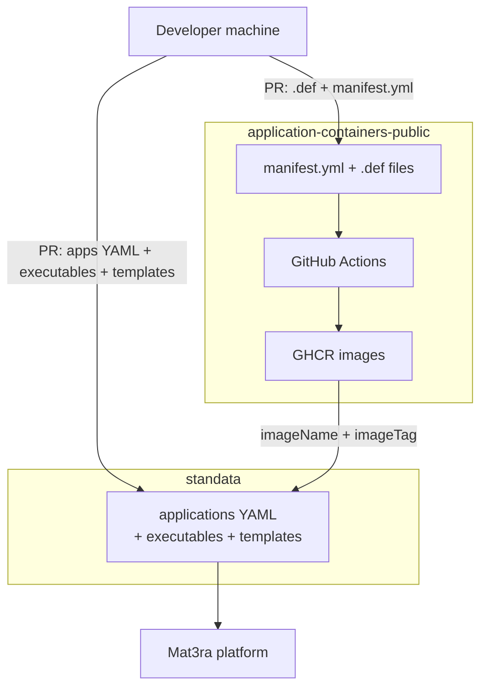

# Contribute New Applications to Mat3ra

!!!abstract "TL;DR"
    Bringing your own application to the Mat3ra platform is a two-step process:

    1. **Build the Image:** Package your application into an Apptainer
    container. Create a PR to the [application-containers-public](
    https://github.com/mat3ra/application-containers-public) repository
    with the Apptainer `.def` file and register it in `manifest.yml`. Merge this
    PR first so the container image is built and published to the GitHub
    Container Registry (GHCR).

    2. **Update the Metadata:** Add the application's YAML metadata, templates,
    and executables, ensuring your image tag matches Step 1 exactly. Create a PR
    to the [standata](https://github.com/mat3ra/standata) repository. Once
    merged and deployed, the application will be available on both the
    web-interface and the CLI.

This page explains how developers and advanced users can contribute new
application to the Mat3ra platform so that it becomes a first-class option in
both the web-interface and the [Command Line Interface (CLI)](/cli/overview).

This task involves adding necessary configurations to two repositories via pull
requests. A basic understanding of container technologies (such as Apptainer,
Singularity, or Docker), a GitHub account, [Node.js](https://nodejs.org)
installed in local development machine, and a working Apptainer `.def` file are
required before proceeding. If you need help with preparing Apptainer
definition, please consult the [Add Software](/cli/actions/add-software) page
first.


## 1. Overview

### 1.1. Understand the two-repository architecture

Contributing a new application involves creating Pull Requests (PRs) to two
repositories:

[**application-containers-public**](
https://github.com/mat3ra/application-containers-public) holds the Apptainer
definition files and a `manifest.yml` that drives a GitHub Actions (GHA)
workflow. On merge, GHA builds each image and pushes it to the GitHub Container
Registry (GHCR).

[**standata**](https://github.com/mat3ra/standata) holds the platform
metadata, including application name, version, build flavor, the GHCR image tag
to pull, and the runtime environment variables. The platform reads this
repository to populate the application dropdown in the web-interface. Necessary
modulefiles are also generated based on these metadata for CLI use.

The two repositories are coupled by `imageName` and `imageTag`: the value
provided to `standata` must exactly match the value registered in
`application-containers-public`. As a result, the container pull request must be
merged and the image published before the `standata` pull request can be merged.




## 2. `application-containers-public` repository

### 2.1. Fork and clone the repository

First, fork [github.com/mat3ra/application-containers-public](
https://github.com/mat3ra/application-containers-public) on GitHub, then
clone the fork locally. The top-level layout is:

```
application-containers-public/
├── base/
├── espresso/
├── lammps/
├── nwchem/
├── manifest.yml
├── inheritance-tree.png
└── .github/workflows/cicd.yml
```

Under `base/` are foundational images: AlmaLinux base, GNU toolchain variant,
Intel OneAPI variant, NVIDIA HPC SDK variant, and so on. Each application has
its own subdirectory containing one `.def` file per build variant.

### 2.2. Add the `.def` file

Add the Apptainer definition file under the appropriate application directory,
e.g. `espresso/espresso-7.5-gnu.def`. Two conventions must be followed.

First, bootstrap from an existing base image using `Bootstrap: oras` wherever
possible:

```singularity
Bootstrap: oras
From: ghcr.io/mat3ra/application-containers-public/almalinux-apptainer-gnu:9.7-2
```

This reuses tested toolchains and keeps build times short.

Second, source the parent environment file at the top of `%post`:

```singularity
%post
    if [ -f /.singularity.d/env/91-environment.sh ]; then
        . /.singularity.d/env/91-environment.sh
    fi
```

This picks up environment variables (e.g. OpenMPI `PATH` and `LD_LIBRARY_PATH`)
set by the parent base image. Application-specific runtime variables belong in
the `%environment` section.

!!!tip "Multi-stage builds"
    In order to keep image size small, use a first stage that compiles against
    the large toolchain, then copy only the compiled executables into a
    lightweight final stage. The Mat3ra platform bind-mounts the required
    runtime libraries from the host compute node at job execution time.

!!!warning "Do not bake large toolchains into the image"
    Libraries such as NVIDIA HPC SDK and Intel OneAPI are pre-installed on the
    clusters and available via NFS. Embedding them would produce images tens of
    GB in size. Declare them instead as `environmentVariables` in `standata`
    (see [Section 3.2](#32-add-the-application-version-block)).

### 2.3. Register the image in `manifest.yml`

Open `manifest.yml` at the repository root and add an entry for the new
application:

```yaml
- name: espresso
  path: espresso/espresso-7.5-gnu.def
  tag: 7.5-gnu-1
```

The three fields are:

- `name` → the image name in the registry.
- `path` → location of the `.def` file relative to the repository root.
- `tag` → follows the convention `<version>-<toolchain>-<N>` where `N` is a
  build iteration starting from `0`. Bump `N` whenever the recipe changes
  without a version change for the application; the CI treats tags as immutable
  and skips a build if the tag already exists.

### 2.4. Open the pull request and verify the build

Open a pull request against the `main` branch of
`application-containers-public`. The CI workflow iterates over `manifest.yml`,
checks whether each tag already exists in GHCR, and if not, runs
`apptainer build` and `oras push`. On pull requests the push step is skipped
(dry run); the image is published only after the PR is merged.

After merge, the image is available at:

```bash
apptainer pull oras://ghcr.io/mat3ra/application-containers-public/espresso:7.5-gnu-1
```

The image name, and tag are needed in the next section.

### 2.5. Example Pull Requests
- [GNU build of Quantum ESPRESSO 7.5](https://github.com/mat3ra/application-containers-public/pull/7/changes)
- [Intel build of LAMMPS](https://github.com/mat3ra/application-containers-public/pull/9/changes)


## 3. `standata` repository

!!!info
    Although the `standata` repository contains JavaScript code, the only
    changes required to add new application are in the YAML files. YAML is a
    human-readable data serialization format, containing key-value pairs, lists,
    and nested structures, very similar to JSON or dictionaries in Python and
    other programming languages.

### 3.1. Fork and clone the repository

Fork [github.com/mat3ra/standata](https://github.com/mat3ra/standata)
and clone locally. The relevant subtree is:

```
assets/applications/
├── applications/
│   ├── application_data.yml
│   ├── espresso.yml
│   ├── lammps.yml
│   └── ...
├── executables/
└── templates/
```

Each application has its own YAML file under `applications/`, and
`application_data.yml` is the index that the build process reads.

### 3.2. Add application version block

Create or extend the YAML file for the new application, e.g.
`assets/applications/applications/espresso.yml`. Each version block follows this
structure:

```yaml
- version: '7.5'
  isDefault: true
  build: GNU
  hasAdvancedComputeOptions: true
  buildConfig:
    moduleName: '7.5-gnu'
    imageName: 'espresso'
    imageTag: '7.5-gnu-1'
    bio: 'Quantum ESPRESSO 7.5 (GCC 11.5.0, OpenMPI 4.1.1 and OpenBLAS)'
    dependencies:
      - 'mpi/ompi-4.1.1'
    environmentVariables: {}
```

The `imageName` and `imageTag` fields must exactly match what was registered in
`manifest.yml` in the container repository. This is the link between the two
repositories.

For applications that require mapping host-side toolchains (e.g. NVIDIA HPC SDK
or Intel OneAPI), declare the Apptainer environment forwarding variables under
`environmentVariables`. The prefix `APPTAINERENV_` instructs Apptainer to inject
the variable into the container at runtime:

```yaml
environmentVariables:
  APPTAINERENV_PREPEND_PATH: '${SOFTWARE_LIBRARIES_PATH}/nvidia/hpc-sdk/bin'
  APPTAINERENV_LD_LIBRARY_PATH: '${SOFTWARE_LIBRARIES_PATH}/nvidia/hpc-sdk/lib'
```

`SOFTWARE_LIBRARIES_PATH` is a platform-native variable that resolves to the
correct host directory for the cluster the job lands on. Consult an existing
CUDA or Intel entry in `espresso.yml` as a template when the exact paths are
unknown.

The remaining fields are:

- `isDefault: true` → marks the version selected by default in the UI.
- `hasAdvancedComputeOptions: true` → exposes the advanced compute settings
  panel.
- `build` → the flavor label shown in the version submenu (e.g. `GNU`,
  `Intel`, `CUDA`).

### 3.3. Register in `application_data.yml`

Add a single `!include` statement to
`assets/applications/applications/application_data.yml`:

```yaml
espresso: !include 'applications/espresso.yml'
```

In order to expose executables in the UI or provide starter input templates,
also populate `assets/applications/executables/<app>/` and
`assets/applications/templates/<app>/` respectively.

### 3.4. Add an executable

The executable YAML describes the command that the platform runs, the input
files it expects, and the results and monitors it produces. Create
`assets/applications/executables/myapp/myapp.yml` following the LAMMPS
pattern:

```yaml
isDefault: true
monitors:
  - standard_output
results: []
flavors:
  myrun:
    isDefault: true
    input:
      - name: flavor.in
    results: []
    monitors:
      - standard_output
    applicationName: myapp
    executableName: myexec
```

Each key in `flavors` corresponds to one flavor visible in the workflow designer
unit editor. The `input` list names the input files the template system will
render. `monitors` controls which output streams the platform captures in real
time (at minimum `standard_output`).

Then register the executable in `assets/applications/executables/tree.yml`:

```yaml
myapp:
  myapp: !include 'executables/myapp/myapp.yml'
```

### 3.5. Add an input file template and flavor

The template system connects the executable flavor to a rendered input file.
This is what the user sees and edits inside the workflow designer unit editor.

**Step 1: Write the raw input file.** Create the actual input content under
`assets/applications/input_files_templates/myapp/flavor.in`. This is the
default input script that a user starts from. It may be a static file or
contain [Jinja](https://jinja.palletsprojects.com/) template variables if the
platform should substitute material-specific values at runtime.

**Step 2: Write the flavor YAML.** Create
`assets/applications/templates/myapp/flavor.yml`:

```yaml
- content: !readFile 'input_files_templates/myapp/flavor.in'
  name: flavor.in
  contextProviders: []
  applicationName: myapp
  executableName: myexec
```

The `!readFile` tag inlines the raw input file at build time. `contextProviders`
is an optional list of platform context plugins that inject material or job
properties into the template at render time; leave it empty for a static
template.

**Step 3: Register the flavor in `templates.yml`.** Add a line to
`assets/applications/templates/templates.yml`:

```yaml
# myapp
- !include 'templates/myapp/flavor.yml'
```

After these three steps, the `flavor` appears in the unit editor when a user
selects `myapp` as the application and `myexec` as the executable.

### 3.6. Build and validate locally

Run the following commands in the `standata` checkout to verify that the YAML
parses correctly and the generated data looks as expected:

```bash
npm install
npm run build:applications
npm run build  # to build all assets
npm run test # to run the tests
```

`build:applications` generates per-application JSON under `data/applications/`.
Inspect the diffs to confirm the version block is present, the `imageTag`
matches the container repository, the executable flavor appears, and the
template content renders correctly.

### 3.7. Open the pull request

Open a pull request against `standata` only after the container pull request
has been merged and the image is live in GHCR. Commit the generated files under
`data/` and `dist/` produced by the build step above.

### 3.8. Example Pull Requests
- [Quantum ESPRESSO 7.5](https://github.com/mat3ra/standata/pull/109/changes)
- [LAMMPS](https://github.com/mat3ra/standata/pull/91/changes)

One may ignore the auto-generated files under `data/`, `dist/`, and `src/`
directories while reviewing the PR changes.


## 4. Merge order and checklist

Merge order is mandatory: the container pull request must be merged first so
that the image tag referenced in `standata` is valid when that PR is reviewed.

### 4.1. `application-containers-public` PR Checklist
  ✅ `.def` file added under the correct application directory <br/>
  ✅ `manifest.yml` entry with correct name, path, and tag <br/>
  ✅ CI passes (dry-run build succeeds) <br/>
  ✅ Merged first

### 4.2. `standata` PR Checklist
  ✅ `applications/myapp.yml` with matching `imageName` and `imageTag` <br/>
  ✅ `!include` added to `application_data.yml` <br/>
  ✅ `executables/myapp/myapp.yml` with at least one flavor <br/>
  ✅ `myapp` entry added to `executables/tree.yml` <br/>
  ✅ `input_files_templates/myapp/flavor.in` created <br/>
  ✅ `templates/myapp/flavor.yml` created <br/>
  ✅ `!include` added to `templates/templates.yml` <br/>
  ✅  `npm run build` outputs committed <br/>
  ✅ Merged after the container PR is merged

Once both PRs are merged and the next platform release ships, the application
appears in the application dropdown for every user. The container image is
pulled from GHCR on first use, the version block drives the runtime environment,
and the flavor/template pair appears in the workflow designer unit editor. The
application is also available via modulefile for CLI use.


## 5. References

- Apptainer Definition and container building: [Adding New Software](/cli/actions/add-software)
- Container repository: [github.com/mat3ra/application-containers-public](https://github.com/mat3ra/application-containers-public)
- Metadata repository: [github.com/mat3ra/standata](https://github.com/mat3ra/standata)
- Published images: [Mat3ra packages on GHCR](https://github.com/orgs/mat3ra/packages?repo_name=application-containers-public)
